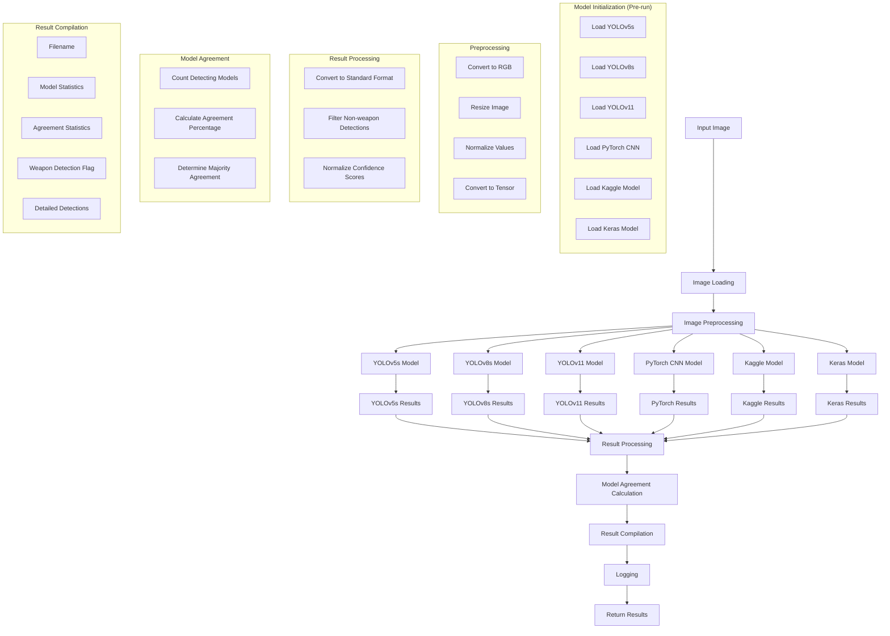

```mermaid
flowchart TD
    A[Input Image] --> B[Image Loading]
    B --> C[Image Preprocessing]
    
    C --> D1[YOLOv5s Model]
    C --> D2[YOLOv8s Model]
    C --> D3[YOLOv11 Model]
    C --> D4[PyTorch CNN Model]
    C --> D5[Kaggle Model]
    C --> D6[Keras Model]
    
    D1 --> E1[YOLOv5s Results]
    D2 --> E2[YOLOv8s Results]
    D3 --> E3[YOLOv11 Results]
    D4 --> E4[PyTorch Results]
    D5 --> E5[Kaggle Results]
    D6 --> E6[Keras Results]
    
    E1 --> F[Result Processing]
    E2 --> F
    E3 --> F
    E4 --> F
    E5 --> F
    E6 --> F
    
    F --> G[Model Agreement Calculation]
    G --> H[Result Compilation]
    H --> I[Logging]
    I --> J[Return Results]
    
    subgraph "Model Initialization (Pre-run)"
        M1[Load YOLOv5s]
        M2[Load YOLOv8s]
        M3[Load YOLOv11]
        M4[Load PyTorch CNN]
        M5[Load Kaggle Model]
        M6[Load Keras Model]
    end
    
    subgraph "Preprocessing"
        P1[Convert to RGB]
        P2[Resize Image]
        P3[Normalize Values]
        P4[Convert to Tensor]
    end
    
    subgraph "Result Processing"
        R1[Convert to Standard Format]
        R2[Filter Non-weapon Detections]
        R3[Normalize Confidence Scores]
    end
    
    subgraph "Model Agreement"
        A1[Count Detecting Models]
        A2[Calculate Agreement Percentage]
        A3[Determine Majority Agreement]
    end
    
    subgraph "Result Compilation"
        C1[Filename]
        C2[Model Statistics]
        C3[Agreement Statistics]
        C4[Weapon Detection Flag]
        C5[Detailed Detections]
    end
``` 